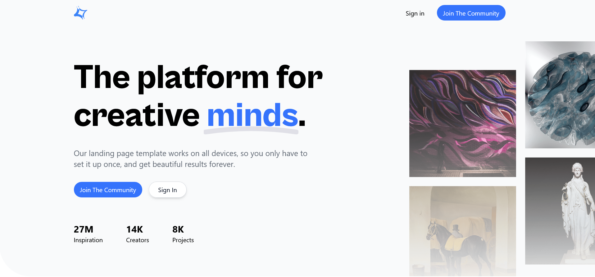

# Creative Landing Page Clone

A frontend clone of the [Creative landing page](https://preview.cruip.com/creative/index.html) built from scratch using React and Tailwind CSS. This is a **practice project** created for learning purposes and portfolio demonstration. I do not claim ownership of the original design — all credit goes to the original creators at [Cruip](https://cruip.com/).

## Live Preview

[LIVE PREVIEW](https://creative-steel.vercel.app/)

## Landing page



## Tech Stack

- **React.js**
- **Vite**
- **Tailwind CSS**
- **React Router DOM**
- **JavaScript (ES6+)**

## Installation

```bash
git clone <repository-url>
cd <repository>
npm install
npm run dev
```

## What I Learned

- Structuring a multi-section landing page with reusable React components
- Responsive layout design with Tailwind CSS utility classes
- Client-side routing with React Router DOM
- Building and deploying a Vite-powered React application
- Translating a design reference into pixel-accurate UI code

## Author

- GitHub: [@Rozuwan](https://github.com/Rozuwan)

## Acknowledgements

- Original design by [Cruip](https://cruip.com/)
- Built with [React](https://react.dev/) + [Vite](https://vite.dev/) + [Tailwind CSS](https://tailwindcss.com/)


